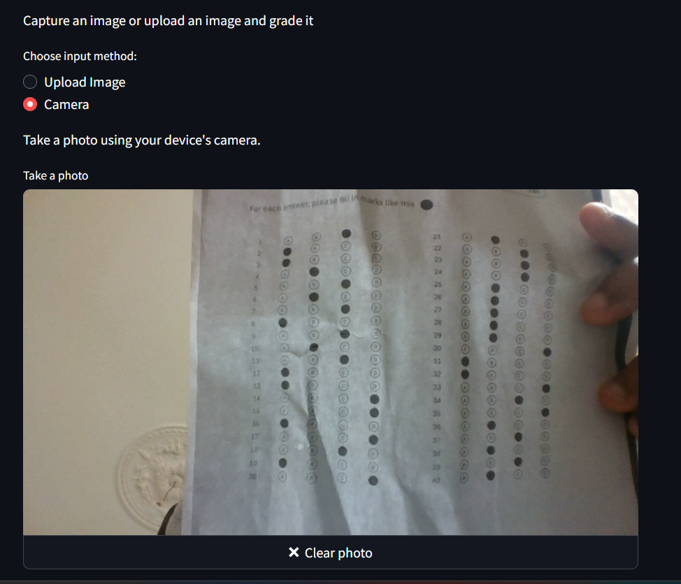
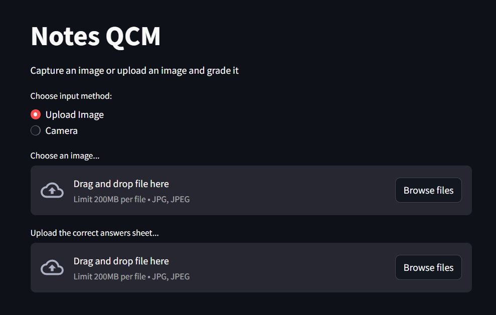
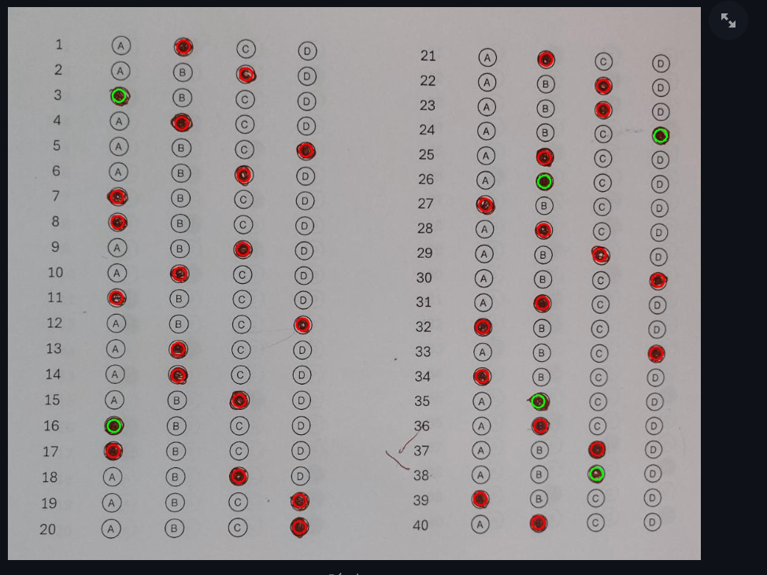
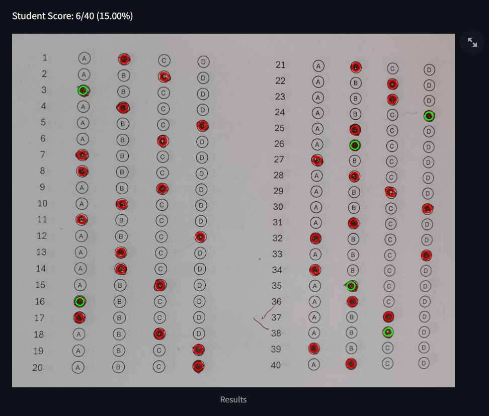
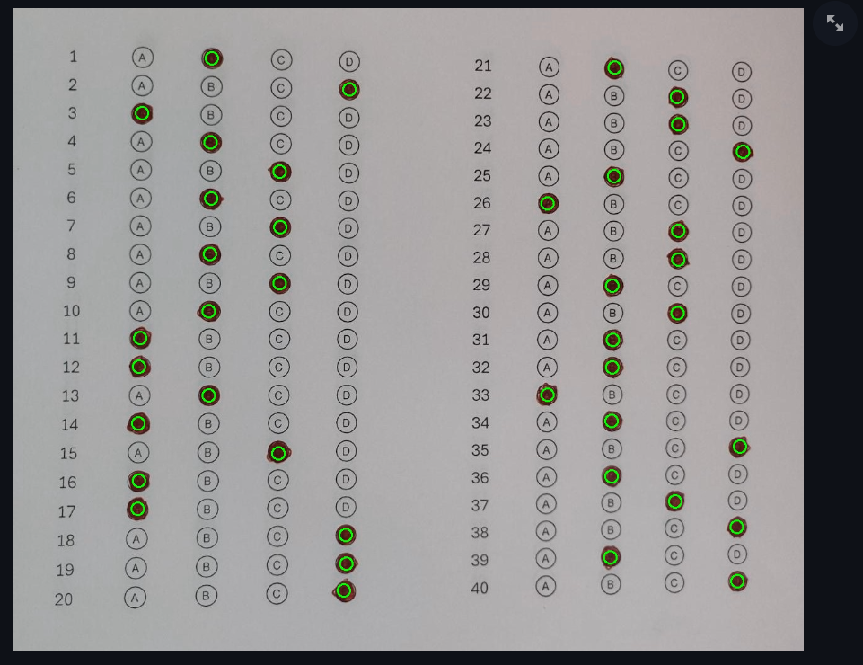

# MCQ Grader using OMR techniques

## Description

This project is a web application that allows you to capture or upload an image of a MCQ answer sheet, detect filled circles, and compare the answers with a correct answer sheet to evaluate the student's score.

## Features

- Capture images using the device's camera.
- Upload images from your computer.
- Detect filled circles on the answer sheet.
- Compare answers with a correct answer sheet.
- Display the student's final score.

## Technologies Used

- Python
- OpenCV
- NumPy
- Streamlit
- PIL (Python Imaging Library)

## Installation

To install and configure this project, follow these steps:

1. Clone the repository:
   ```bash
   git clone https://github.com/Ravel226/Bubble_Sheet_Corrector.git
   cd Bubble_Sheet_Corrector
   ```

2. Create Virtual Environment (Optionnal)

    Open the terminal in your code editor (crtl + %)
    Enter these commands depending on your Operating System :

    MAC

    ```bash
    python3 -m venv venv
    source venv/bin/activate
    ```

    WINDOWS

    ```bash
    python -m venv venv
    venv\Scripts\activate
    ```

3. Install the dependencies:
   ```bash
   pip install -r requirements.txt
   ```

4. Run the Streamlit application:
   ```bash
   streamlit run app.py
   ```

## Usage

1. Open the application in your web browser.
2. Choose the input method: "Upload Image" or "Camera".
3. If you choose "Camera", take a photo of the answer sheet.
4. If you choose "Upload Image", upload an image of the answer sheet.
5. Upload the correct answer sheet.
6. The application will detect filled circles and compare the answers to display the student's final score.

## Images

Here are some screenshots of the application in action:


*Capture an image using the device's camera.*


*Upload an image from your computer.*


*Detected filled circles on the answer sheet.*


*Display the student's final score.*


*Bonus image (I was really proud of this one)*

## Contributing

Contributions are welcome! To contribute to this project, follow these steps:

1. Fork the repository.
2. Create a branch for your feature (`git checkout -b feature/your-feature`).
3. Commit your changes (`git commit -m 'Add your feature'`).
4. Push the branch (`git push origin feature/your-feature`).
5. Open a Pull Request.

## License

This project is licensed under the MIT License. See the [LICENSE](LICENSE) file for details.

## Contact

For any questions or suggestions, please contact me at [ravellewourougou@gmail.com](mailto:ravellewourougou@gmail.com).

---

Thank you for using MCQ Grader!
```